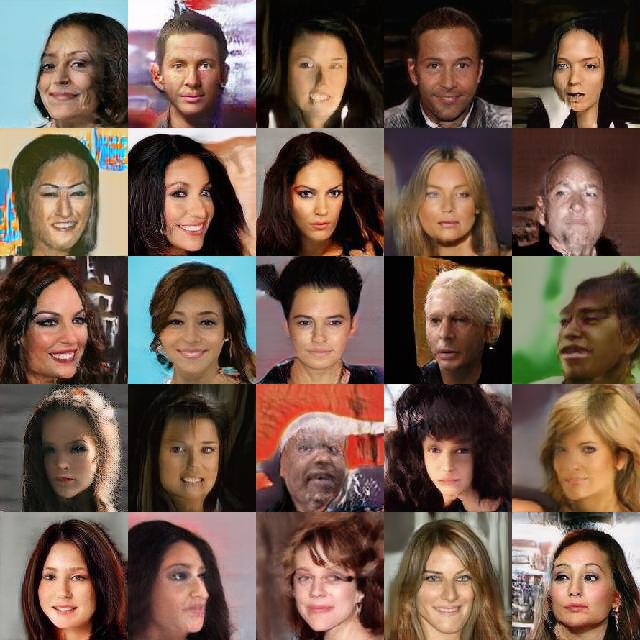
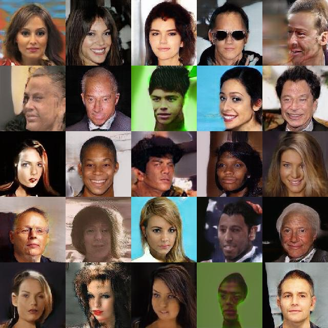
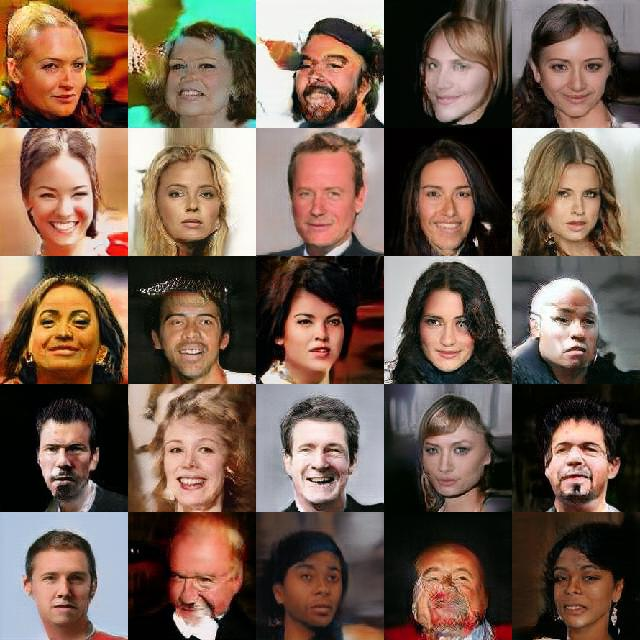
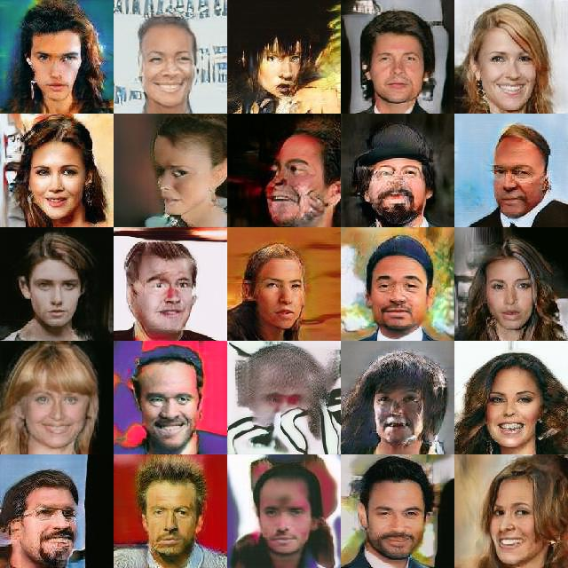

# chainer-StyleBasedGAN
Style-Based GANs implemented with chainer.

Large part of Implementation is based on https://github.com/joisino/chainer-PGGAN

 `python 3.5.2` + `chainer 5.1.0`

## Usage

### Training

```
$ python3 ./train.py -g 0 --dir ./train_images/ --epoch 3 --depth 0 
```

You can train models with `./train.py`.

When `depth = n`, generated images are `2^{n+2} x 2^{n+2}` size.

```
$ ./procedure.sh
```

The whole training procedure is written in `procedure.sh` (through `8 x 8` to `128 x 128`), but it is recommended to run each training steps separately.

You should tune `delta` and `epoch` when it changes too quickly or too slowly.

### Generating
```
python3 generate.py --gpu -1 --sgen sgen --depth 5 --out img/ --num 100
```

## Result
Generated images when trained 3 epoch for depth=1, 2, 3, 4, and 5 epoch for depth=5.
Dataset: CelebA(https://www.kaggle.com/jessicali9530/celeba-dataset/version/2)






## Bibliography

[1] https://arxiv.org/abs/1812.04948

The original paper

[2] https://github.com/joisino/chainer-PGGAN

Chainer Progressive GAN implementation.

[3] https://github.com/pfnet-research/chainer-gan-lib/tree/master/dcgan

Referred to for standard updater implementation.
